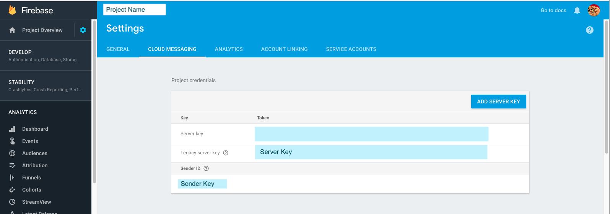

<h1>Introduction</h1>
INTUZ brings to you a very useful component to send FCM push-notifications to Android and iOS application from your node-js projects. Give it a try by following below example, Happy push notifications.

<br>
<h1>Features</h1>

- Send push notification to Android and iOS devices using FCM
- Support to save notification into database (sample sql file provided)

<h1>Getting Started</h1>

> Install fcm https://www.npmjs.com/package/fcm-push

```
npm install fcm-push
```
> Add push-notification.js file in your project and replace your server-key

```
var serverKey = 'xxxxxxxxxxxxxxxxxxxxxxxxxxxx'; // Server Key
```

> To generate your server key, set up your project in Firebase Console https://console.firebase.google.com/

> Select your project and go to CLOUD MESSAGING tab
  


> Add this in your .js file

```
var push  = require('push-notification'); // on the top of your file

app.post('/your-api-action', function(req, res, next) {
	// ...your code...

	// Send push notification to device
	push.pushnfc().sendNotification(user_id, device_token, device_type, 'signup', msg_body);

	// Save push notification into db
	push.pushnfc().saveNotification(req, user_id, to_user_id, message, type, '0', '1');	
});
```
<br>

<h1>Bugs and Feedback</h1>

For bugs, questions and discussions please use the Github Issues.

<br>
<h1>License</h1>

Copyright (c) 2018 INTUZ.
<br><br>
Permission is hereby granted, free of charge, to any person obtaining a copy of this software and associated documentation files (the "Software"), to deal in the Software without restriction, including without limitation the rights to use, copy, modify, merge, publish, distribute, sublicense, and/or sell copies of the Software, and to permit persons to whom the Software is furnished to do so, subject to the following conditions:
<br><br>
THE SOFTWARE IS PROVIDED "AS IS", WITHOUT WARRANTY OF ANY KIND, EXPRESS OR IMPLIED, INCLUDING BUT NOT LIMITED TO THE WARRANTIES OF MERCHANTABILITY, FITNESS FOR A PARTICULAR PURPOSE AND NONINFRINGEMENT. IN NO EVENT SHALL THE AUTHORS OR COPYRIGHT HOLDERS BE LIABLE FOR ANY CLAIM, DAMAGES OR OTHER LIABILITY, WHETHER IN AN ACTION OF CONTRACT, TORT OR OTHERWISE, ARISING FROM, OUT OF OR IN CONNECTION WITH THE SOFTWARE OR THE USE OR OTHER DEALINGS IN THE SOFTWARE.

<h1></h1>
<a href="http://www.intuz.com">

</a>
